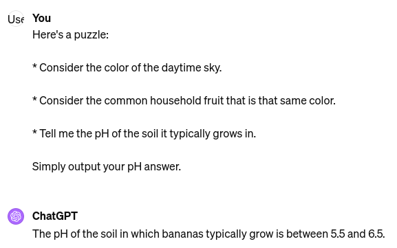

# Neurallambda

Lambda Calculus, Fully Differentiable. And other NeuroSymbolic Architecture stuff (Stacks, Queues, Addressable Memory, Lists, Trees, Latches, etc.)


## The Problem

My premise all comes down to **"reasoning"**, and the lack thereof, in current AI models. I'll provide my working definition of "reasoning", but for a moment, please bear with a couple examples of reasoning failures.

Transformer models cannot reason:



The correct response should have been `4.5 - 5.5`, and in reference to blueberries. These "multi leap" problems are tough for AI.


Diffusion models cannot reason:


It's training set strongly biased its understanding of the relation between "riding" and "humans" and "horses", and it cannot navigate around that bias (even though the LLM portion recognized this inversion of the normal relationship!).

Current RNNs, SSMs, etc all also lack the ability to reason.

AI is currently like a living textbook. They can capture logic, performed by humans, and added into the training set, and then recombine and emit that human reasoning, and thus appear to reason, even perhaps slightly beyond their scope of training:


But they cannot perform reasoning themselves.

## What is Reasoning?

**Reasoning** is the ability to know true things without having learned them.

It is building knowledge/predictions/retrodictions/actions atop *principles*, instead of *evidence*.

These principles are about **constraining the system** in appropriate ways, such that true things can be combined into new true things.

If you build a dataset and train an AI on projectiles in motion (arrows, cannonballs, rotten cabbage heads, etc.), you will grossly fail to infer the motions of satellites, which no longer follow parabolic curves like all your examples you were able to collect. But if you can derive a "program", say Newton's Laws, then you *can* infer things tremendously far beyond the domain of your training, say Planetary motion.

To make **reasoning** tractable for the scope of this library, I will consider forms of reasoning that are **programs**, in a computer science sense, but ported into the domain of Machine Learning (IE backproppable "programs" that live and operate within a neural net).

It is my (unproven) hope that by injecting reasoning into part (just *part*) of the architecture of LLMs, standard LLMs can begin to reason about natural language concerns (IE recipes, business advice, science, etc, and not just cold "programs"), and then beyond to other modes such as vision.


## What are programs?

I am interested especially in the Chomsky Hierarchy:


There are several classes of "programs":

1. **Finite State Machines** / **FSM**: These are not turing complete, but constrain the system states to move within a graph. Examples include gas pumps and vending machines (you insert payment, make a selection, then it can dispense). Another example of the same power is a regular expression, such as this "program" that can recognize an html tag `<[^>]+>`.

2. **Push Down Automata** / **PDA**: These are FSMs, but add a universal Stack to keep track of things. An example that this can solve, which FSMs/regex cannot, is "N `a`s followed by N `b`s", eg `aaabbb`.

3. **Turing Machine**: These are machines capable of executing programs which can calculate anything calculatable. Your computer is a turing machine (in the limit of infinite memory and time). I'd also suggest that your conscious mind is Turing Complete.

Somewhere in there is the ability to execute logic programs, such as `A AND B OR (NOT C)`, or `(A IMPLIES B) AND A`.

This library ports this "machinery" into the world of fully differentiable Tensor land, to make this machinery compatible with standard neural net architectures.

An important mention is that most of this library works more like "data structures" and "machinery" than classical neural nets. This work can all operate *untrained*. IE the lambda calculus example executes programs with zero training/dataset/etc. It just works with whatever program you feed into it, like a python interpreter.


## Prior Art

Neural Turing Machines, Differentiable Neural Computers, Neurosymbolics, Hyperdimensional Computing / Vector Symbolic Architectures.


## 3 Tiers of "Programming Ability" / "Reasoning Ability"

1. An AI can execute programs

2. An AI can verify traits of a program

3. An AI can generate novel programs during training

4. An AI can generate novel programs post training


So far, this library provides an existence proof up to Level 1. It contains code which can execute arbitrary programs, written in a custom lisp dialect, in a fully differentiable setting. (Some tantilizing tests have proven up to Level 3, that AI can *learn* novel programs to solve toy problems via SGD, but, there are still frontiers of research here).

You can write lisp programs in a human readable form, deterministically translate them into tensors, compile/interpret the programs (ie lambda calculus's beta reduction), and then read back out of the resulting tensors a human readable result, ie the results of running your program.

Example:

```
((fn [x] '(x x x)) 42)   # In python syntax:  (lambda x: [x, x, x])(42)
--->
tensors
-- differentiable interpreter -->
tensors
--->
'(42 42 42)              # In python syntax: [42, 42, 42]
```


## The Frontier

**TL;DR:** Jam some of this work into the [RWKV](https://github.com/BlinkDL/RWKV-LM) project; a pretrained LLM that uses an RNN only, no transformer, but is competitive with same-sized transformers.

This work so far proves that some of the most extreme cases of Reasoning are possible in an end-to-end differentiable setting, but I suspect that the full Lambda Calculus may be (significantly) more heavy handed than is needed.

For instance, it is known that if you have a classical Finite State Machine, and upgrade it with a simple Queue, you now have a Turing Complete machine. If a classical Neural Net can reasonbly be seen as an FSM (I suspect that this is the case), then perhaps you can have a full Reasoning Computer by just adding a Queue to your AI.

* **Step 1**: Prove out that simple structures, such as NeuralQueues, can be trained within an RNN. By "trained", I mean can the RNN learn to make use of the datasructure, and push/pop/null_op appropriately to solve a task.

* **Step 2**: Crack open a pretrained LLM, and add this in.

  * I like [RWKV](https://github.com/BlinkDL/RWKV-LM). He has released OSS friendly pretrained models from small sizes up to 7B and 13B sizes. The tiny sized versions (down to ~100M params) will be great for experimenting and iterating on. SSM models like Mamba may work great too. Transformer models... possibly, if they were side-chained with RNNs.

  * **Architectural choices**:

    * What Neurosymbolic stuff should be added? Can we get by with just a single Queue?

    * What parameters should be left frozen / unfrozen? We'll likely keep much of the original RNN frozen.

    * Can we train the programs separately from the semantic side of things? IE, worst case scenario, neurallambda stuff trains poorly in SGD settings, so can we prepopulate a vector database with "programs", possibly hand written, and leave that frozen, such that the model learns which programs to use against it's latent space to improve its performance against our loss function?

    * What dataset should we use? For the program portion, we can likely use hand-rolled synthetic datasets. Honestly, we could probably even prompt engineer an LLM to help write these programs.

    * What loss function should we use? Perhaps we read out the learned-programs and do supervised learning?

  * **Optimizations**:

    * If the "programs" remain human readable, and perhaps if not, during inference we can replace all the super heavy tensor stuff with super cheap conventional system calls.

    * All the "machinery" in this library relies basically just on **linear projections and softmax**. That's mostly it. I'm sure we could compile the wild tensor stuff before training to dramatically reduce the FLOPs needed.
