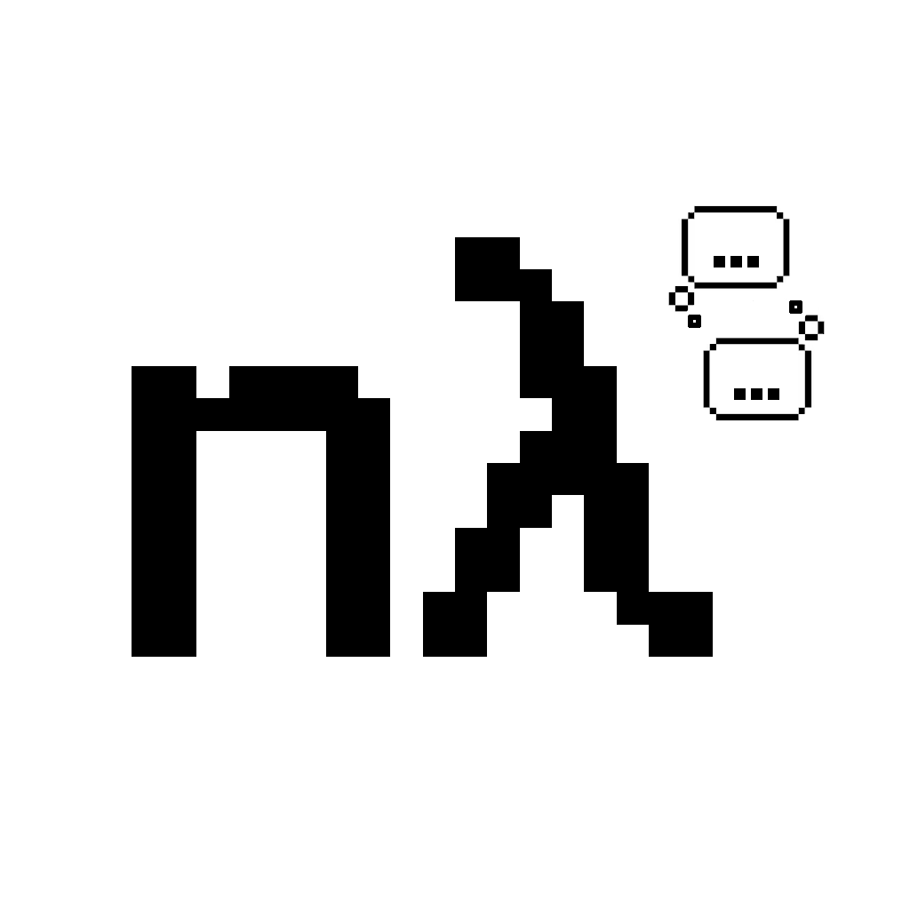

# neurallambda - V2 Homoiconic AI

<a href="https://x.com/neurallambda">
  
</a>
&nbsp;&nbsp;
<a href="https://discord.gg/HRrPTQn2Uf">
  
</a>

<div align="center">
  
</div>


*Reasoning is the ability of a system to execute, and generate programs in arbitrary settings.*


# V1: Reasoning AI, via Differentiable Lambda Calculus

*(feel free to skip V1; V2 is a dramatic simplification, that is a spiritual cousin to V1 but shares no code.)*

V1's [documentation](doc/README_V1_Lambda_Calculus_Variant.md) explains this first version thoroughly.

In short, V1 allows a network to input/output programs (lambda calculus expressions) that are fully differentiable by design, and to interpret/compile them in a fully differentiable way (beta reduction).

The programs are given as inputs, and the beta reduction steps are hard wired architectural decisions, including the use of addressable neural memory, and neural stacks. The architecture deterministically, without training, allows program expressions to to be compiled.

So in a sense, this closes the gap between "data" and "code" - the inputs *are* the code that runs, if given a compiler.

But the mechanics needed for the neuralcompiler are quite complex, and I think V2 simplifies this dramatically.


# V2: Reasoning AI, via Unifying Data and Computation

> [!NOTE]
>
> V2 is in experimentation mode. All the code lands here, and I talk about it on [X/@neurallambda](https://x.com/neurallambda).

**TL;DR** Augmenting LLMs with a "weight" modality that allows LLMs to input/generate/apply weight updates within the stream of tokens they normally output. In other words, a language model that can also output metatokens that represent matrix weights, and will get interpreted within the transformer stack's various linear layers.

**Example:** Usage of the LLM roughly looks like this:

```
"""
Let me plan a new way to solve this. <weights>||||||||</weights>. Ok let's go...
""'
```

The `<weights>` get parsed out, and interpreted as low rank matrices over the transformer stack's own linear layers. This technique is model agnostic and would work on any neural net architecture (CNN, RNN, Mixer, SSM, Diffusion, etc), and likely many non neural architectures.


## V2 layout

V1, V2, and miscellani all lives in this repo. The homoiconic LLM stuff lives here:

```sh
experiment/
    t14_homoiconic_llm_05.py
    t14_homoiconic_llm_add_tokens.py
    t14_homoiconic_llm_columnize_04.py
    t14_homoiconic_llm_data_02.py
    t14_homoiconic_llm_model.py
```

## Brief explanation

The **"Data"** portion of an LLM are vector inputs/outputs.

The **"Computation"** portion of an LLM are the Linear layers' matrix weights, frozen after training.

**"Homiconic"** refers to treating Data and Computation as the same substrate.

So if you want an AI to be able to Reason, I believe you need to make the Computation step a first class citizen: let the model deal in the 'language' of computation directly, ie add a metaweight modality in addition to the natural language modality, and allow the network to output updates to it's own weights. (see 'hypernetworks', and PFC-Basal Ganglia-Working Memory)

**Why might this work?**

The FFNN/MLP block in a Transformer operates as a K-V store (separate from the QKV in self attention). That K-V store is where it memorizes facts during training. If you make a Key of "Michael Jordan", it will select a Value out of the 2nd linear layer in the MLP that holds semantics like "Basket Ball, Chicago Bulls, etc.".

If you allow metaweight updates, I hope that it'll be able to use the KV capacity of the MLP to store new facts in context. For instance, "John is the new investor" could get saved into this fact store to be made use of later; a fact which is only relevant in the current context, bc not all John's are the new investor.

This could give it the capacity for solving tasks that require "multihop" reasoning, something LLMs struggle with. For instance:

```
a=1
b=2
c=a+b
```

It could save `a=1` into the store, `b=2`, and then instead of `c=a+b`, it could save `c=3`. Next time `c` is referenced, you've closed a gap of variable indirection, bc `c` just equals `3` now; a fact which it will access not from attending within the context window, but straight out of the KV store.

Note, unlike Neural Turing Machines, there's no "read/write/move pointer" commands it must learn, it's just outputting weight updates.

If this KV store ability works, it hopefully follows that the attention mechanisms can be adapted, in context, for the network to build out useful memory indexing schemes for itself (like a Turing Machine?)

I was pleased when the Transfusion paper dropped, because they proved out what I was already doing - that discrete language tokens could be mixed with continous-valued image (or metaweight) embeddings.

**So where is Neurallambda V2 at now?**

The grunt work of building out the core architecture is complete, and it's not too complex.

It's actually quite elegant!

It currently allows building atop Qwen/Llama/Mistral so that they can be finetuned to gain this homoiconism capacity (🤞)

Experiments are giving mixed results, some very promising, and I'm trying to stabilize training. Lots of little design decisions remain to be made along this path.

What's in the future?

I am building this opensource, and hope to tantalize some of you to get involved. A million experiments remain to dial in the appropriate architecture, optimize things, write cuda kernels, point out my boneheaded mistakes, pick the right research to integrate, etc.

I will librarify this, and continue the experiments, and post results here.

Then, once this demonstrates interesting results on toy problems, I hope to find someone willing to grant some compute to scale it up, and make the first:

```
Mistral-7B-Reasoning-20241225.safetensors
```

Wish us luck!
